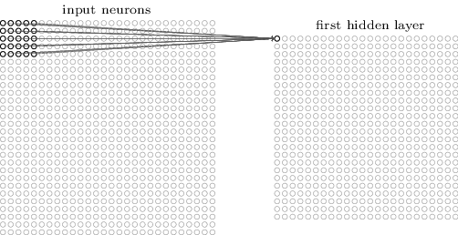

## 深度学习简介

深度学习是指多层神经网络上运用各种机器学习算法解决图像，文本等各种问题的算法集合。深度学习从大类上可以归入神经网络，不过在具体实现上有许多变化。深度学习的核心是特征学习，旨在通过分层网络获取分层次的特征信息，从而解决以往需要人工设计特征的重要难题。深度学习是一个框架，包含多个重要算法：

- Convolutional Neural Networks(CNN)卷积神经网络
- AutoEncoder自动编码器
- Sparse Coding稀疏编码
- Restricted Boltzmann Machine(RBM)限制波尔兹曼机
- Deep Belief Networks(DBN)深信度网络
- Recurrent neural Network(RNN)多层反馈循环神经网络神经网络

对于不同问题(图像，语音，文本)，需要选用不同网络模型才能达到更好效果

此外，最近几年增强学习(Reinforcement Learning)与深度学习的结合也创造了许多了不起的成果，AlphaGo就是其中之一

## 人类视觉原理
深度学习的许多研究成果，离不开对大脑认知原理的研究，尤其是视觉原理的研究

1981 年的诺贝尔医学奖，颁发给了 David Hubel（出生于加拿大的美国神经生物学家） 和TorstenWiesel，以及 Roger Sperry。前两位的主要贡献，是“发现了视觉系统的信息处理”，可视皮层是分级的

人类的视觉原理如下：从原始信号摄入开始（瞳孔摄入像素 Pixels），接着做初步处理（大脑皮层某些细胞发现边缘和方向），然后抽象（大脑判定，眼前的物体的形状，是圆形的），然后进一步抽象（大脑进一步判定该物体是只气球）。下面是人脑进行人脸识别的一个示例：

对于不同的物体，人类视觉的认知过程也是类似的

我们可以看出，在最底层，也就是不同物体对边缘的认知，是相似的，进而由边缘组成一些特征，最终由各种特征组成最终的图形。这也是卷积神经网络灵感的来源，通过构造多层神经网络，将多层特征进行组合，最终在顶层做出分类

## 卷积神经网络

### 优势
在全连接神经网络中，每相邻层中的每个神经元都要相连，在输入层的特征维度增加时，全连接神经网络需要训练的参数会增大很多，训练时间也会变得很长，这一点在图像识别中十分明显，如一张28×28的单通道图像，输入层的神经元就有784个，如下图：

若中间使用一层隐藏层，待训练参数就有768×15个，在实际应用中图像的尺寸一般远大于28×28像素，参数过多的问题就更加明显

而卷积神经网络的神经元只与前一层中的部分神经元节点连接，并不是全连接，并且同一层的神经元之间共享连接权重矩阵，这样大大减少了需要训练的参数量。所以卷积神经网络广泛应用于图像处理领域，下文也将以图像处理为例介绍

### 结构

- 输入层：输入的数据
- 卷积层：使用卷积核对输入的特征进行提取
- 激励层：添加非线性映射
- 池化层：减少数据运算量
- 全连接层：在CNN尾部全连接，为输出层做准备
- 输出层：输出结果向量

### 输入层

在卷积神经网络的输入层中，保留了图片数据的原格式，对于28×28的图像，输入为28×28的二维矩阵

### 卷积层

- local receptive fields 感受视野
- shared weights 共享权重

仍以28×28像素的图像为例，输入是一个28×28的二维矩阵，定义一个5×5的感受视野，即每个隐藏层的神经元与输入层的5×5个神经元相对应，这个区域成为感受视野

即每个隐藏神经元以一个固定大小的视野去感受上一层的特征，全连接神经网络可以看做具有无限大的感受视野。由于卷积神经网络的感受视野有限，所以上一层的其他特征可以通过平移感受视野来获得。

上图为步长为1的平移，平移时应从左到右扫描，每次移动步长距离，扫描完之后移动到下一行，再次从左到右扫描，过程如下：

卷积神经网络的隐藏层节点只与前一层中的部分节点相连接，每一条连接对应一个权重 w，我们将这个感受视野的 w 矩阵称为卷积核，将感受视野相对上一层的扫描间隔称为步长，当步长大于1时，为了扫描到边缘的一些特征，感受视野可能会出界，这时需要对边界进行扩充，一般以0填充

此外，卷积核 w 矩阵可以带有一个偏移 b

我们将通过同一个卷积核的感受视野产生的下一层矩阵称为特征映射图(feature map)，因此同一个特征映射图上的卷积核是相同的，其中的神经元共享权重和偏移，我们可以使用多个卷积核，输出多个特征映射图

以上图为例，该卷积层共含有三个卷积核，我们需要训练的参数减少到了 (5 * 5 + 1) * 3 = 78 个

### 激励层

激励层主要对卷积层的输入进行一个非线性映射，因为卷积层的计算还是一种线性计算，一般使用ReLu函数，故卷积层和激励层通常合称为卷积层

### 池化层

当输入经过卷积层时，若感受视野和步长相对于输入层较小，得到的特征映射图还是比较大，可以通过池化层对每一个特征映射图进行降维处理，输出的深度仍为特征映射图的个数

池化层中同样有一个池化视野对特征映射图进行扫描，对池化视野内的神经元计算一般有两种方式：

- Max pooling 取池化视野中最大值
- Average pooling 取池化视野中平均值

扫描过程同卷积层

将前文的特征映射图池化得到下图

### 全连接层 & 输出层

全连接层主要对前一层的特征进行重新拟合，减少信息的丢失，经输出层转化为输出向量

### 加速训练

批量归一化 (Batch Normalization) 实现了在神经网络中间进行预处理的操作，即将上一层的输出进行归一化处理后再传入下一层，这样可以有效防止“梯度弥散”加速网络训练

### 训练过程

卷积神经网络与传统神经网络相似，也是用了反向传播的算法

- 第一阶段，向前传播阶段
	- 从样本中取出一个样本集，将样本集的输入值输入网络
	- 计算出该样本集的输出值

- 第二阶段，向后传播阶段
	- 计算实际输出与样本集理想输出的误差
	- 按极小化误差法调整权值矩阵

## 经典卷积神经网络

- LeNet (1990s)： LeNet 是推进深度学习领域发展的最早的卷积神经网络之一。经过多次成功迭代，到 1988 年，Yann LeCun 把这一先驱工作命名为 LeNet5。当时，LeNet 架构主要用于字符识别任务，比如读取邮政编码、数字等等。

- 1990s to 2012：在上世纪 90 年代后期至 2010 年初期，卷积神经网络进入孵化期。随着数据量和计算能力的逐渐发展，卷积神经网络可以处理的问题变得越来越有趣。

- AlexNet (2012) – 在 2012，Alex Krizhevsky （与其他人）发布了 AlexNet，它是比 LeNet 更深更宽的版本，并在 2012 年的 ImageNet 大规模视觉识别大赛（ImageNet Large Scale Visual Recognition Challenge，ILSVRC）中以巨大优势获胜。这对于以前的方法具有巨大的突破，当前 CNN 大范围的应用也是基于这个工作。

- ZF Net (2013) – ILSVRC 2013 的获胜者是来自 Matthew Zeiler 和 Rob Fergus 的卷积神经网络。它以 ZFNet （Zeiler & Fergus Net 的缩写）出名。它是在 AlexNet 架构超参数上进行调整得到的效果提升。

- GoogLeNet (2014) – ILSVRC 2014 的获胜者是来自于 Google 的 Szegedy等人的卷积神经网络。它的主要贡献在于使用了一个 Inception 模块，可以大量减少网络的参数个数（4M，AlexNet 有 60M 的参数）。

- VGGNet (2014) – 在 ILSVRC 2014 的领先者中有一个 VGGNet 的网络。它的主要贡献是展示了网络的深度（层数）对于性能具有很大的影响。

- ResNets (2015) – 残差网络是何凯明（和其他人）开发的，并赢得 ILSVRC 2015 的冠军。ResNets 是当前卷积神经网络中最好的模型，也是实践中使用 ConvNet 的默认选择（截至到 2016 年五月）。

- DenseNet (2016 八月) – 近来由 Gao Huang （和其他人）发表的，the Densely Connected Convolutional Network 的各层都直接于其他层以前向的方式连接。DenseNet 在五种竞争积累的目标识别基准任务中，比以前最好的架构有显著的提升。可以在这里看 Torch 实现。

## 参考文献

[Neural Networks and Deep Learning | Chapter 6 Deep learning](http://neuralnetworksanddeeplearning.com/chap6.html)